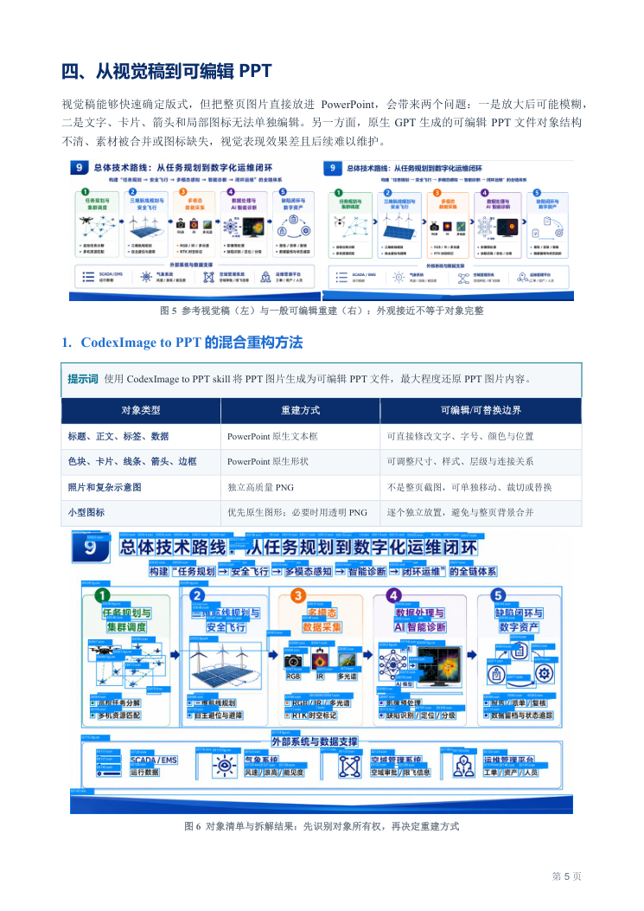
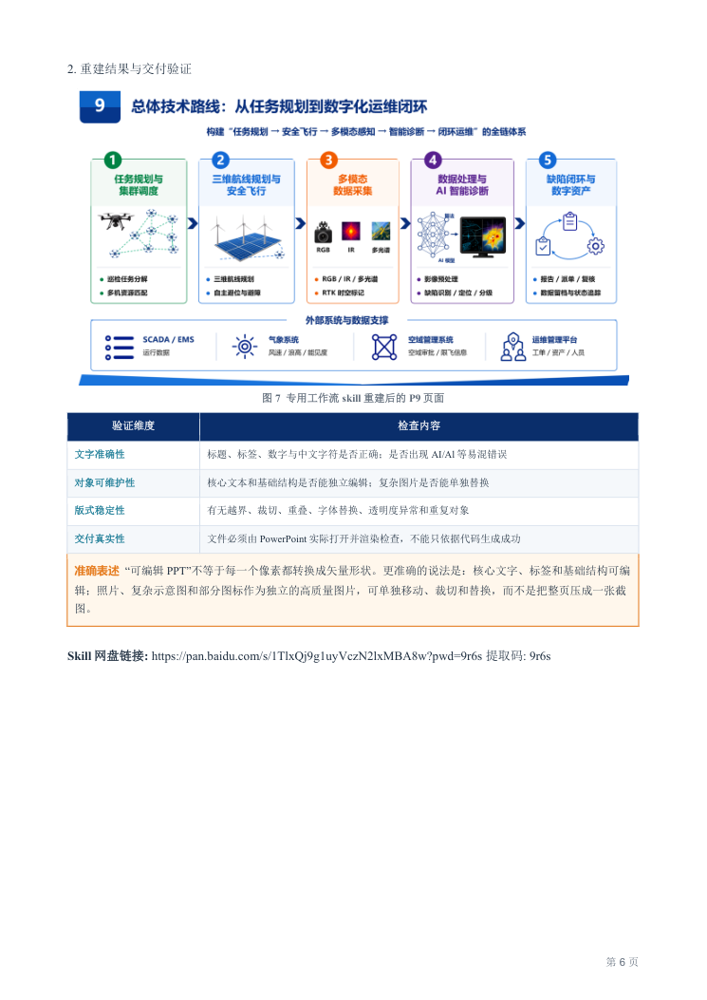

# 学术汇报 PPT 制作过程案例

这份案例总结一套“人工主导、AI 辅助”的学术汇报制作流程，素材来自《南通市“风光同场”海上光伏集群无人机智能巡检系统》汇报项目。它与本仓库的关系是：案例说明内容和视觉如何被组织，本仓库负责把视觉稿进一步重建为可编辑、可验证的 PowerPoint 交付物。

## 工作链路

| 阶段 | AI 可以加速的工作 | 必须由人工把关的工作 |
| --- | --- | --- |
| 资料研读与内容抽取 | 长文档检索、归纳和候选主题整理 | 资料优先级、政策依据、指标和技术边界 |
| 总体框架规划 | 生成 20–30 页结构备选 | 把原报告改造成有叙事主线的汇报 |
| 逐页脚本设计 | 提供标题、正文、图示和版式候选 | 为每页确定唯一回答任务，控制信息密度 |
| 视觉稿生成与迭代 | 形成风格草案、素材和替代版式 | 处理重复、过密、模糊和不合适的视觉层级 |
| 可编辑重建与复核 | 辅助对象拆解和一致性检查 | 核对文字、数据、技术边界、对象可编辑性和最终渲染 |

## 从页面任务到对象表达

案例中将页面内容按编辑价值和重绘风险分成三类：

- 可读文字进入 PowerPoint 原生文本框；
- 色块、卡片、线条、箭头和边框进入原生形状；
- 照片、复杂示意图和风格敏感视觉作为独立高质量 PNG。

这种混合表达既保留页面的视觉层级，也避免把整页压成一张无法维护的截图。`SKILL.md` 在此基础上进一步规定了小图标的视觉核心生成、透明度检查、裁剪归属、清单记录和交付验证。

## 迭代重点

案例中的迭代集中在三类问题：叙事重复、信息密度过高和技术边界表达不清。典型处理包括把复杂步骤压缩为五阶段主线、用空间关系图或技术框图替代均质卡片、减少装饰性图标，以及对概念性示意数据明确标注，避免被误解为实测结果。

## 交付标准

“可编辑 PPT”并不意味着每个像素都必须转为矢量对象。更准确的标准是：核心文字、标签和基础结构可编辑；照片、复杂示意图和部分图标作为独立图片，可以移动、裁切和替换；最终文件必须经过 PowerPoint 或等效渲染器检查，而不能只依据脚本执行成功来判断交付质量。

本案例 PDF 仅用于总结方法，未将其中的外部分享链接、个人路径或过程文件直接放入仓库。

